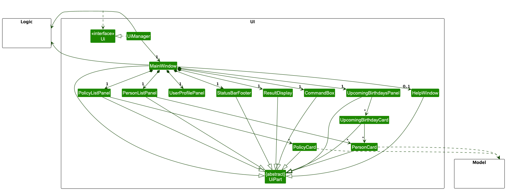
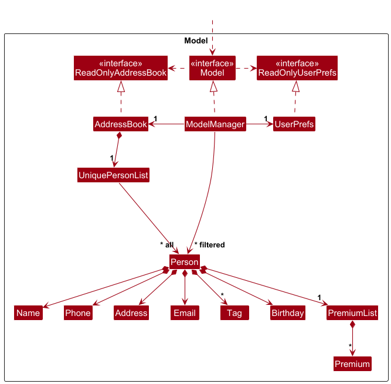
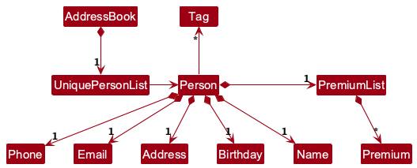
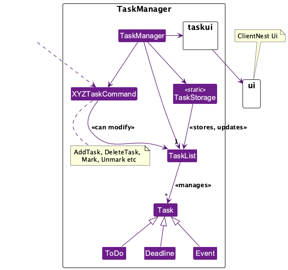

# ClientNest Developer Guide

<!-- * Table of Contents -->
- [Acknowledgements](#acknowledgements)
- [Setting up, getting started](#setting-up-getting-started)
- [Design](#design)
  - [Architecture](#architecture)
  - [UI component](#ui-component)
  - [Logic component](#logic-component)
  - [Model component](#model-component)
  - [Storage component](#storage-component)
  - [Task Manager](#task-manager)
  - [Common classes](#common-classes)
- [Implementation](#implementation)
  - [Premium Management Feature](#premium-management-feature)
    - [Premium Data Structure](#premium-data-structure)
    - [Add Premium Command Implementation](#add-premium-command-implementation)
    - [Edit Premium Command Implementation](#edit-premium-command-implementation)
    - [Delete Premium Command Implementation](#delete-premium-command-implementation)
    - [Design Considerations](#design-considerations)
  - [[Proposed] Undo/redo feature](#proposed-undoredo-feature)
    - [Proposed Implementation](#proposed-implementation)
    - [Design considerations](#design-considerations-1)
- [Planned Enhancement](#planned-enhancement)
  - [Policy-Based Premium Management](#policy-based-premium-management)
    - [Problem Statement](#problem-statement)
    - [Solution](#solution)
  - [Windows Compatibility Issues](#windows-compatibility-issues)
    - [Problem Statement](#problem-statement-1)
    - [Solution](#solution-1)
  - [Inflexible Inputs for Commands field](#inflexible-inputs-for-commands-field)
    - [Problem Statement](#problem-statement-2)
    - [Solution](#solution-2)
- [Documentation, logging, testing, configuration, dev-ops](#documentation-logging-testing-configuration-dev-ops)
- [Appendix: Requirements](#appendix-requirements)
  - [Product scope](#product-scope)
  - [User stories](#user-stories)
  - [Use cases](#use-cases)
  - [Non-Functional Requirements](#non-functional-requirements)
  - [Glossary](#glossary)
- [Appendix: Instructions for manual testing](#appendix-instructions-for-manual-testing)
  - [Launch and shutdown](#launch-and-shutdown)
  - [Deleting A Person](#deleting-a-person)
  - [Adding A Premium To A Person](#adding-a-premium-to-a-person)
  - [Editing A Premium For A Person](#editing-a-premium-for-a-person)
  - [Deleting A Premium From A Person](#deleting-a-premium-from-a-person)
  - [Saving Data](#saving-data) 
  - [Deleting A Premium From A Person](#deleting-a-premium-from-a-person)

<page-nav-print />

--------------------------------------------------------------------------------------------------------------------

## **Acknowledgements**

We would like to express our sincere gratitude to Professor Damith Chatura Rajapakse and Professor Ganesh Neelakanta Iyer for their invaluable guidance and mentorship throughout this project. We also extend our thanks to our tutor, Yu Cong, for their consistent support and constructive feedback.

--------------------------------------------------------------------------------------------------------------------

## **Setting up, getting started**

Refer to the guide [_Setting up and getting started_](SettingUp.md).

--------------------------------------------------------------------------------------------------------------------

## **Design**

### Architecture

The ***Architecture Diagram*** given above explains the high-level design of the App.

Given below is a quick overview of main components and how they interact with each other.

**Main components of the architecture**

**`Main`** (consisting of classes [`Main`](https://github.com/se-edu/addressbook-level3/tree/master/src/main/java/seedu/address/Main.java) and [`MainApp`](https://github.com/se-edu/addressbook-level3/tree/master/src/main/java/seedu/address/MainApp.java)) is in charge of the app launch and shut down.
* At app launch, it initializes the other components in the correct sequence, and connects them up with each other.
* At shut down, it shuts down the other components and invokes cleanup methods where necessary.

The bulk of the app's work is done by the following four components:

* [**`UI`**](#ui-component): The UI of the App.
* [**`Logic`**](#logic-component): The command executor.
* [**`Model`**](#model-component): Holds the data of the App in memory.
* [**`Storage`**](#storage-component): Reads data from, and writes data to, the hard disk.

[**`Commons`**](#common-classes) represents a collection of classes used by multiple other components.

**How the architecture components interact with each other**

The *Sequence Diagram* below shows how the components interact with each other for the scenario where the user issues the command `delete 1`.

Each of the four main components (also shown in the diagram above),

* defines its *API* in an `interface` with the same name as the Component.
* implements its functionality using a concrete `{Component Name}Manager` class (which follows the corresponding API `interface` mentioned in the previous point.

For example, the `Logic` component defines its API in the `Logic.java` interface and implements its functionality using the `LogicManager.java` class which follows the `Logic` interface. Other components interact with a given component through its interface rather than the concrete class (reason: to prevent outside component's being coupled to the implementation of a component), as illustrated in the (partial) class diagram below.

The sections below give more details of each component.

### UI component

The **API** of this component is specified in [`Ui.java`](https://github.com/se-edu/addressbook-level3/tree/master/src/main/java/seedu/address/ui/Ui.java)

The UI consists of a `MainWindow` that is made up of parts e.g.`CommandBox`, `ResultDisplay`, `PersonListPanel`, `StatusBarFooter` etc. All these, including the `MainWindow`, inherit from the abstract `UiPart` class which captures the commonalities between classes that represent parts of the visible GUI.

The `UI` component uses the JavaFx UI framework. The layout of these UI parts are defined in matching `.fxml` files that are in the `src/main/resources/view` folder. For example, the layout of the [`MainWindow`](https://github.com/se-edu/addressbook-level3/tree/master/src/main/java/seedu/address/ui/MainWindow.java) is specified in [`MainWindow.fxml`](https://github.com/se-edu/addressbook-level3/tree/master/src/main/resources/view/MainWindow.fxml)

The `UI` component,

* executes user commands using the `Logic` component.
* listens for changes to `Model` data so that the UI can be updated with the modified data.
* keeps a reference to the `Logic` component, because the `UI` relies on the `Logic` to execute commands.
* depends on some classes in the `Model` component, as it displays `Person` object residing in the `Model`.

### Logic component

**API** : [`Logic.java`](https://github.com/AY2425S2-CS2103-F10-2/tp/tree/master/src/main/java/seedu/address/logic)

Here's a (partial) class diagram of the `Logic` component:

The sequence diagram below illustrates the interactions within the `Logic` component, taking `execute("delete 1")` API call as an example.

<box type="info" seamless>

**Note:** The lifeline for `DeleteCommandParser` should end at the destroy marker (X) but due to a limitation of PlantUML, the lifeline continues till the end of diagram.
</box>

How the `Logic` component works:

1. When `Logic` is called upon to execute a command, it is passed to an `AddressBookParser` object which in turn creates a parser that matches the command (e.g., `DeleteCommandParser`) and uses it to parse the command.
1. This results in a `Command` object (more precisely, an object of one of its subclasses e.g., `DeleteCommand`) which is executed by the `LogicManager`.
1. The command can communicate with the `Model` when it is executed (e.g. to delete a person). 
   Note that although this is shown as a single step in the diagram above (for simplicity), in the code it can take several interactions (between the command object and the `Model`) to achieve.
1. The result of the command execution is encapsulated as a `CommandResult` object which is returned back from `Logic`.

Here are the other classes in `Logic` (omitted from the class diagram above) that are used for parsing a user command:

How the parsing works:
* When called upon to parse a user command, the `AddressBookParser` class creates an `XYZCommandParser` (`XYZ` is a placeholder for the specific command name e.g., `AddCommandParser`) which uses the other classes shown above to parse the user command and create a `XYZCommand` object (e.g., `AddCommand`) which the `AddressBookParser` returns back as a `Command` object.
* All `XYZCommandParser` classes (e.g., `AddCommandParser`, `DeleteCommandParser`, ...) inherit from the `Parser` interface so that they can be treated similarly where possible e.g, during testing.

### Model component
**API** : [`Model.java`](https://github.com/AY2425S2-CS2103-F10-2/tp/tree/master/src/main/java/seedu/address/model)

The `Model` component,

* stores the address book data i.e., all `Person` objects (which are contained in a `UniquePersonList` object).
* stores the currently 'selected' `Person` objects (e.g., results of a search query) as a separate _filtered_ list which is exposed to outsiders as an unmodifiable `ObservableList<Person>` that can be 'observed' e.g. the UI can be bound to this list so that the UI automatically updates when the data in the list change.
* stores a `UserPref` object that represents the user's preferences. This is exposed to the outside as a `ReadOnlyUserPref` objects.
* does not depend on any of the other three components (as the `Model` represents data entities of the domain, they should make sense on their own without depending on other components)

<box type="info" seamless>

**Note:** The class diagrams below represent the internal structure of `AddressBook` and `PolicyBook` and their associated entities.
The `AddressBook` manages a `UniquePersonList`, where each `Person` aggregates multiple immutable fields (e.g., `Name`, `Email`, `Birthday`) and maintains associations to a `PremiumList` (containing zero or more `Premium` objects) and to zero or more `Tag` objects.

The `PolicyBook` manages a `UniquePolicyList`, where each `Policy` consists of value objects such as `PolicyName`, `PolicyNumber`, `PolicyLink`, and `ProviderCompany`. This parallel structure ensures consistency across both person and policy management within the app.

</box>

### Storage component

**API** : [`Storage.java`](https://github.com/AY2425S2-CS2103-F10-2/tp/tree/master/src/main/java/seedu/address/storage)

The `Storage` component,
* can save both address book data, policy book data, user profile data and user preference data in JSON format, and read them back into corresponding objects.
* inherits from both `AddressBookStorage`, `PolicyBookStorage`, `UserProileStorage` and `UserPrefStorage`, which means it can be treated as any one (if only the functionality of only one is needed).
* depends on some classes in the `Model` component (because the `Storage` component's job is to save/retrieve objects that belong to the `Model`)

### Task Manager

**API** : [`TaskManager.java`] (https://github.com/AY2425S2-CS2103-F10-2/tp/tree/master/src/main/java/seedu/address/tasklist)

The `TaskManager` component,
* is a self-contained feature within the application.
* allows users to manage personal tasks like to-dos, deadlines, and events.
* is invoked via the UI, and operates independently of the main application logic.
* is launched via the `TaskManager` button along the top file panel.

The `TaskManager` feature consists of:

* A `TaskManager` class responsible for processing user commands.
* A set of command classes (`AddTask`, `DeleteTask`, `Mark`, etc.) to modfy the list of tasks.
* A storage class (`TaskStorage`) that handles task persistence via a local file.
* A set of task types (`ToDo`, `Deadline`, `Event`).

### Common classes

Classes used by multiple components are in the `seedu.address.commons` package.

--------------------------------------------------------------------------------------------------------------------

## **Implementation**

This section describes some noteworthy details on how certain features are implemented.

### \[Proposed\] Undo/redo feature

#### Proposed Implementation

The proposed undo/redo mechanism is facilitated by `VersionedAddressBook`. It extends `AddressBook` with an undo/redo history, stored internally as an `addressBookStateList` and `currentStatePointer`. Additionally, it implements the following operations:

* `VersionedAddressBook#commit()` — Saves the current address book state in its history.
* `VersionedAddressBook#undo()` — Restores the previous address book state from its history.
* `VersionedAddressBook#redo()` — Restores a previously undone address book state from its history.

These operations are exposed in the `Model` interface as `Model#commitAddressBook()`, `Model#undoAddressBook()` and `Model#redoAddressBook()` respectively.

Given below is an example usage scenario and how the undo/redo mechanism behaves at each step.

Step 1. The user launches the application for the first time. The `VersionedAddressBook` will be initialized with the initial address book state, and the `currentStatePointer` pointing to that single address book state.

Step 2. The user executes `delete 5` command to delete the 5th person in the address book. The `delete` command calls `Model#commitAddressBook()`, causing the modified state of the address book after the `delete 5` command executes to be saved in the `addressBookStateList`, and the `currentStatePointer` is shifted to the newly inserted address book state.

Step 3. The user executes `add n/David …​` to add a new person. The `add` command also calls `Model#commitAddressBook()`, causing another modified address book state to be saved into the `addressBookStateList`.

<box type="info" seamless>

**Note:** If a command fails its execution, it will not call `Model#commitAddressBook()`, so the address book state will not be saved into the `addressBookStateList`.

</box>

Step 4. The user now decides that adding the person was a mistake, and decides to undo that action by executing the `undo` command. The `undo` command will call `Model#undoAddressBook()`, which will shift the `currentStatePointer` once to the left, pointing it to the previous address book state, and restores the address book to that state.

<box type="info" seamless>

**Note:** If the `currentStatePointer` is at index 0, pointing to the initial AddressBook state, then there are no previous AddressBook states to restore. The `undo` command uses `Model#canUndoAddressBook()` to check if this is the case. If so, it will return an error to the user rather
than attempting to perform the undo.

</box>

The following sequence diagram shows how an undo operation goes through the `Logic` component:

<box type="info" seamless>

**Note:** The lifeline for `UndoCommand` should end at the destroy marker (X) but due to a limitation of PlantUML, the lifeline reaches the end of diagram.

</box>

Similarly, how an undo operation goes through the `Model` component is shown below:

The `redo` command does the opposite — it calls `Model#redoAddressBook()`, which shifts the `currentStatePointer` once to the right, pointing to the previously undone state, and restores the address book to that state.

<box type="info" seamless>

**Note:** If the `currentStatePointer` is at index `addressBookStateList.size() - 1`, pointing to the latest address book state, then there are no undone AddressBook states to restore. The `redo` command uses `Model#canRedoAddressBook()` to check if this is the case. If so, it will return an error to the user rather than attempting to perform the redo.

</box>

Step 5. The user then decides to execute the command `list`. Commands that do not modify the address book, such as `list`, will usually not call `Model#commitAddressBook()`, `Model#undoAddressBook()` or `Model#redoAddressBook()`. Thus, the `addressBookStateList` remains unchanged.

Step 6. The user executes `clear`, which calls `Model#commitAddressBook()`. Since the `currentStatePointer` is not pointing at the end of the `addressBookStateList`, all address book states after the `currentStatePointer` will be purged. Reason: It no longer makes sense to redo the `add n/David …​` command. This is the behavior that most modern desktop applications follow.

The following activity diagram summarizes what happens when a user executes a new command:

#### Design considerations:

**Aspect: How undo & redo executes:**

* **Alternative 1 (current choice):** Saves the entire address book.
    * Pros: Easy to implement.
    * Cons: May have performance issues in terms of memory usage.

* **Alternative 2:** Individual command knows how to undo/redo by
  itself.
    * Pros: Will use less memory (e.g. for `delete`, just save the person being deleted).
    * Cons: We must ensure that the implementation of each individual command are correct.

--------------------------------------------------------------------------------------------------------------------

## **Planned Enhancemnet**

### Policy-Based Premium Management

#### Problem Statement:

The system currently supports two separate operations: assigning premiums to individuals via the addpr command and creating policies using the addpolicy command. However, these functionalities operate in isolation—premiums and policies are managed as independent entities. This separation allows premiums to be assigned without validating the existence of a corresponding policy in the policybook. Such a design can result in premiums being linked to non-existent or invalid policies, potentially causing data inconsistencies and user confusion.

#### Solution:

To enforce consistency between premiums and policies, the following enhancements should be made to the addpr command:

1. Add policy_id as a Required Field in addpr
2. Validate Policy Existence Before Adding a Premium
3. Handle Outcomes with Clear User Feedback: 
    * If the specified policy_id does not exist:
        * Reject the command, do not add the premium
        * Provide a clear error message: "Policy ID POL123 not found. Please create the policy first using addpolicy."
    * Else the specified policy_id exists:
        * Proceed with adding the premium to the person under the given policy
        * Provide confirmation: "Premium with Policy ID POL123 has been added"

### Windows Compatibility Issues

#### Problem Statement:

We're encountering an issue where, upon fullscreening the application on Windows, certain UI elements (such as the command box) end up partially hidden behind the Windows taskbar. This seems to be specific to how fullscreen dimensions are handled on Windows systems. Unfortunately, our team currently doesn't have access to a Windows environment, so we're unable to reproduce and resolve the bug directly.

#### Solution:

Possible solution our team can do in the future:
1. Download windows virtual machine and use it to test our product

### Inflexible Inputs for Commands field

#### Problem Statement:

The Command input field currently enforces strict validation rules, including restrictions on special characters in certain fields. As a result, commands that include characters users might reasonably expect to use (e.g., punctuation in names or notes) are rejected. This leads to a poor user experience, as users may find the behavior unintuitive and frustrating—especially if they are not familiar with the exact syntax or limitations. 

Some examples but not limited are:
1. Names with special characters `Anne-Marie`
2. Policy Name with special characters `Health & Safety`
3. Policy Number with special characters `#102`

#### Solution:

* Relex the validation rules by updating regrex to handle more useful cases

--------------------------------------------------------------------------------------------------------------------

## **Documentation, logging, testing, configuration, dev-ops**

* [Documentation guide](Documentation.md)
* [Testing guide](Testing.md)
* [Logging guide](Logging.md)
* [Configuration guide](Configuration.md)
* [DevOps guide](DevOps.md)

--------------------------------------------------------------------------------------------------------------------

## **Appendix: Requirements**

### Product scope

**Target user profile**:

Target User: Alex
* Alex is a young, fresh financial advisor (FA).
* He recently graduated and is eager to build a strong client base.
* He wants to grow his career by maintaining meaningful client relationships.
* He struggles with tracking numerous client interactions and follow-ups.
* He often forgets key touchpoints like birthdays and policy renewals.
* He needs a system that reminds him who to contact and when to engage with clients.
* Sometimes, he feels overwhelmed managing client relationships manually.
* He can type fast and prefers a CLI interface over mouse inputs

**Value proposition**: Young financial advisors often struggle with managing a high volume of client interactions, making it easy to miss key follow-ups and important milestones. Keeping track of numerous touchpoints manually can feel overwhelming, leading to missed opportunities and weaker client relationships. ClientNest helps young financial advisors stay organized, manage clients more effectively, build stronger relationships, enhance trust, and focus on growing their business.

### User stories

Priorities: High (must have) - `* * *`, Medium (nice to have) - `* *`, Low (unlikely to have) - `*`

| Priority | As a …​                         | I want to …​                                                                                        | So that I can…​                                                                   |
|----------|---------------------------------|-----------------------------------------------------------------------------------------------------|-----------------------------------------------------------------------------------|
| `* `     | young financial advisor         | be able to add clients and client details                                                           | track the clients                                                                 |
| `* `     | young financial advisor         | view all my client interactions in one application                                                  | not miss any important follow-up opportunities                                    |
| `* `     | young financial advisor         | be able to delete any non-current client information                                                | have an overview of only the relevant clients                                     |
| `* `     | young financial advisor         | access usage instructions                                                                           | easily refer to them when I need help using the app                               |
| `* *`    | young financial advisor         | be guided through the initial setup process                                                         | start using the system quickly and efficiently                                    |
| `* * `   | young financial advisor         | access a help center or FAQ section                                                                 | quickly find answers to common questions                                          |
| `* * `   | young financial advisor         | set and receive reminders for important client touchpoints                                          | maintain meaningful relationships with my clients                                 |
| `* * *`  | young financial advisor         | sync ClientNest with my calendar                                                                    | manage my time and appointments more efficiently                                  |
| `* * *`  | young financial advisor         | have the system analyze client engagement history and suggest optimal times for follow-ups          | proactively nurture relationships and never miss a chance to connect              |
| `* * *`  | young financial advisor         | have a checklist for each client meeting                                                            | ensure all necessary points are covered and nothing is missed                     |
| `* * *`  | young financial advisor         | categorize client interactions by type (e.g., phone call, email, in-person meeting)                 | see the variety of communication methods used and stay on top of all touchpoints  |
| `* `     | young financial advisor         | add a detailed description to client profiles                                                       | remember important personal details about each client                             |
| `* *`    | young financial advisor         | store links to my clients' policies                                                                 | easily access important documents and provide timely support when needed          |
| `* *`    | intermediate financial advisor  | receive notifications for missed follow-ups                                                         | avoid letting important interactions slip through the cracks                      |
| `* *`    | intermediate financial advisor  | track the status of each client (e.g., potential, active, dormant)                                  | prioritize my efforts and focus on high-value opportunities                       |
| `* * *`  | intermediate financial advisor  | create a visual timeline of client interactions and goals                                           | easily track progress and plan future actions                                     |
| `* *`    | intermediate financial advisor  | receive notifications when a client's policy is up for renewal                                      | proactively reach out to clients for reviews or updates                           |
| `* * *`  | intermediate financial advisor  | create client engagement plans (e.g., weekly check-ins, monthly newsletters)                        | structure my interactions effectively                                             |
| `* * *`  | intermediate financial advisor  | assign tasks related to clients (e.g., send documents, schedule meetings)                           | stay organized and accountable                                                    |
| `* *`    | intermediate financial advisor  | search my client base by name, date of last contact, or milestone                                   | quickly find relevant information and stay on top of important interactions       |
| `* *`    | intermediate financial advisor  | store client preferences (e.g., communication method, preferred times)                              | tailor my outreach to each client's needs                                         |
| `* *`    | intermediate financial advisor  | keep track of client milestones (e.g., policy anniversaries, life events)                           | celebrate and engage with them at meaningful times                                |
| `* *`    | intermediate financial advisor  | have a history of client interactions available in the system                                       | review past conversations and provide better service                              |
| `* * *`  | intermediate financial advisor  | easily track client satisfaction and feedback                                                       | improve my service and relationships with clients                                 |
| `* * *`  | intermediate financial advisor  | have the system automatically log my client interactions                                            | avoid manually entering every detail and focus on building strong relationships   |
| `* *`    | expert financial advisor        | add personal notes about clients (e.g., preferences, key conversations)                             | engage with them on a more personal level and deepen our relationship             |
| `* * *`  | expert financial advisor        | automate the process of sending follow-up emails                                                    | avoid missing opportunities for ongoing engagement                                |
| `* * *`  | expert financial advisor        | have the system suggest best practices for client relationship management based on the data I input | improve my approach over time and build stronger, long-lasting relationships      |
| `* * *`  | expert financial advisor        | track my client retention rate                                                                      | assess my success in building long-term relationships                             |
| `* * *`  | expert financial advisor        | track all my client interactions by topic (e.g., retirement, investment, insurance)                 | track ongoing discussions more effectively and address client concerns accurately |

### Use cases

(For all use cases below, the **System** is the `ClientNest` and the **Actor** is the `Young Undergraduate/Graduate Financial Advisor`, unless specified otherwise)

**Use case: View Client List Overview**

**MSS**

1. User requests to list all clients.
2. ClientNest retrieves and displays a list of clients.

   Use case ends.

**Extensions**

* 2a. Client retrieval issues.
    * 2a1. ClientNest shows an error message.

      Use case ends.

* 2b. Deleted clients continue to show up.
    * 2b1. ClientNest refreshes the client list and removes deleted clients.

      Use case resumes at step 2.

---

**Use case: Add a Client**

**MSS**

1. User requests to add a new client with details (name, optional fields).
2. ClientNest validates for details of the input fields.
3. ClientNest adds the client to the database.
4. ClientNest confirms the addition.

   Use case ends.

**Extensions**

* 2a. One or more input fields are invalid.
    * 2a1. ClientNest shows an error message:
        * "Please input valid name" (if name is missing or invalid).
        * "Please input valid address" (if address is invalid).
        * "Please input valid phone number" (if phone number is invalid).
        * "Please input valid email" (if email is invalid).
        * "Please input valid birthday" (if birthday format is incorrect).
        * "Please input valid premiumList" (if premiumList field is invalid).
    * 2a2. Use case resumes at step 1.

* 3a. Client already exists in the database.
    * 3a1. ClientNest shows an error message and displays the existing client details.

      Use case ends.

* 3b. Database error occurs while saving the client.
    * 3b1. ClientNest shows an error message.

      Use case ends.

---

**Use case: Delete a Client**

**MSS**

1. User requests to delete a specific client by name.
2. ClientNest validates the input.
3. ClientNest deletes the client from the database.
4. ClientNest confirms the deletion.

   Use case ends.

**Extensions**

* 2a. The provided name is invalid or empty.
    * 2a1. ClientNest shows an error message: "Please input valid name."

      Use case resumes at step 1.

* 3a. The client does not exist in the database.
    * 3a1. ClientNest shows an error message: "Client not found."

      Use case ends.

* 3b. A database error occurs while deleting the client.
    * 3b1. ClientNest shows an error message.

      Use case ends.

---

**Use case: Add a Premium to a Client**

**MSS**

1. User requests to add a premium to a specific client by index.
2. ClientNest validates the client index and premium details.
3. ClientNest adds the premium to the client.
4. ClientNest confirms the addition.

   Use case ends.

**Extensions**

* 2a. The client index is invalid.
    * 2a1. ClientNest shows an error message: "Invalid person displayed index."
    * 2a2. Use case resumes at step 1.

* 2b. The premium name is invalid or empty.
    * 2b1. ClientNest shows an error message: "Premium name must be provided."
    * 2b2. Use case resumes at step 1.

* 3a. The premium to delete does not exist for the client.
    * 3a1. ClientNest modifies the client without affecting other premiums.
    * 3a2. Use case continues at step 4.

**Use case: Edit a Premium for a Client**

**MSS**

1. User requests to edit a premium for a specific client by index.
2. ClientNest validates the client index and premium details.
3. ClientNest updates the premium for the client.
4. ClientNest confirms the edit.

   Use case ends.

**Extensions**

* 2a. The client index is invalid.
    * 2a1. ClientNest shows an error message: "Invalid person displayed index."
    * 2a2. Use case resumes at step 1.

* 2b. The premium format is invalid.
    * 2b1. ClientNest shows an error message: "At least one field to edit must be provided."
    * 2b2. Use case resumes at step 1.

* 3a. The premium to edit does not exist for the client.
    * 3a1. ClientNest shows an error message: "Premium name given does not exist."
    * 3a2. Use case ends.

**Use case: Delete a Premium from a Client**

**MSS**

1. User requests to delete a premium from a specific client by index.
2. ClientNest validates the client index and premium name.
3. ClientNest removes the premium from the client.
4. ClientNest confirms the deletion.

   Use case ends.

**Extensions**

* 2a. The client index is invalid.
    * 2a1. ClientNest shows an error message: "Invalid person displayed index."
    * 2a2. Use case resumes at step 1.

---

### Non-Functional Requirements

1. Should work on any _mainstream OS_ as long as it has Java `17` or above installed.
2. The system should be able to handle up to 1000 clients and their records without noticeable degradation in response time during typical usage.
3. A user with above average typing speed for regular English text (i.e. not code, not system admin commands) should be able to accomplish most of the tasks faster using commands than using the mouse.
4. The system should ensure that client data is accurate and consistent throughout its lifecycle. No data should be lost, corrupted, or incorrectly altered during normal operations or when interacting with the system.
5. The application should provide a clean, intuitive, and user-friendly interface. It should be easy for financial advisors with varying levels of technical expertise to navigate, with minimal learning required.
6. The system's search functionality should return relevant client and interaction data in less than 1 second, even when the database contains a significant amount of records (up to 1000 clients).
7. The system should process and respond to common actions, such as adding, updating, or viewing clients, within 2 seconds, ensuring smooth and efficient user interactions.
8. The system should be able to export client data in common, standard formats (e.g., CSV, Excel, JSON) to allow for easy transfer or analysis of data.
9. The application should ensure the confidentiality and integrity of client data, employing encryption for sensitive data both in transit and at rest
10. The system should be able to recover from unexpected failures, such as crashes or server downtime, and resume normal operation without data loss or corruption. The recovery process should complete within a reasonable time (e.g., within 5 minutes).
11. The system should remain functional and should not crash under conditions like incorrect user inputs, unexpected data formats, or server overload. It should handle errors gracefully and provide users with meaningful error messages without interrupting the overall user experience.

### Glossary

* **Financial Advisor (FA)**: A professional who provides financial services and advice to clients, including investment management, tax planning, and estate planning.
* **Client**: An individual or organization for whom financial advisory services are provided, whose details are stored within the system.
* **CLI Interface**: A text-based user interface that allows users to interact with software by typing commands.
* **Commands**: Instructions given by a user to perform specific operations within the system.
* **User Interface (UI)**: The means through which a user interacts with the system, encompassing design, layout, and interactive elements
* **CSV (Comma-Separated Values)**: A file format that uses commas to separate values, commonly used for data exchange between applications
* **Excel**: A spreadsheet program developed by Microsoft, used for data organization and analysis.
* **JSON (JavaScript Object Notation)**: A lightweight data interchange format that is easy for humans to read and write, and for machines to parse and generate.
* **Premium**: An insurance policy or product assigned to a client, typically containing a name and an amount.
* **Policy**: A formal agreement or contract between a client and an insurer, detailing the terms of coverage, rights, and responsibilities.
* **Help Center**: A section of the application that provides assistance through FAQs, articles, or troubleshooting tips for users.
* **Non-Functional Requirements**: System characteristics that are not related to specific functionalities, such as performance, security, scalability, and usability

--------------------------------------------------------------------------------------------------------------------

## **Appendix: Instructions for manual testing**

Given below are instructions to test the app manually.

<box type="info" seamless>

**Note:** These instructions only provide a starting point for testers to work on;
testers are expected to do more *exploratory* testing.

</box>

### Launch and Shutdown

1. Initial launch

    1. Download the jar file and copy into an empty folder

    1. Double-click the jar file Expected: Shows the GUI with a set of sample contacts. The window size may not be optimum.

1. Saving window preferences

    1. Resize the window to an optimum size. Move the window to a different location. Close the window.

    1. Re-launch the app by double-clicking the jar file. 
       Expected: The most recent window size and location is retained.

### Deleting A Person

1. Deleting a person while all persons are being shown

    1. Prerequisites: List all persons using the `list` command. Multiple persons in the list.

    1. Test case: `delete 1` 
       Expected: First contact is deleted from the list. Details of the deleted contact shown in the status message.

    1. Test case: `delete 0` 
       Expected: No person is deleted. Error details shown in the status message.

    1. Other incorrect delete commands to try: `delete`, `delete x`, `...` (where x is larger than the list size) 
       Expected: Similar to previous.

### Adding A Premium To A Person

1. Adding a premium to a person while all persons are being shown

    1. Prerequisites: List all persons using the `list` command. Multiple persons in the list.

    1. Test case: `addpr 1 pr/LifeShield $300` 
       Expected: A premium named "LifeShield" with amount "$300" is added to the first person in the list. Details of the updated person shown in the status message. 

    1. Test case: `addpr 0 pr/LifeShield $300` 
       Expected: No premium is added. Error details shown in the status message. 

    1. Test case: `addpr 1 pr/LifeShield $300` (when the premium already exists) 
       Expected: No premium is added. Error message indicating duplicate premium is shown. 

    1. Other incorrect commands to try: `addpr`, `addpr 1`, `addpr 1 pr/`, `addpr x pr/LifeShield $300` (where x is larger than the list size) 
       Expected: Similar to previous error cases.

### Editing A Premium For A Person

1. Editing a premium for a person while all persons are being shown

    1. Prerequisites: List all persons using the `list` command. Multiple persons in the list. The first person has a premium named "LifeShield".

    1. Test case: `editpr 1 pr/LifeShield $350` 
       Expected: The premium named "LifeShield" for the first person is updated to have amount "$350". Details of the updated person shown in the status message. 

    1. Test case: `editpr 1 pr/NonExistentPremium $350` 
       Expected: No premium is edited. Error message indicating the premium doesn't exist is shown. 

    1. Other incorrect commands to try: `editpr`, `editpr 1`, `editpr 1 pr/`, `editpr x pr/LifeShield $350` (where x is larger than the list size) 
       Expected: Similar to previous error cases.

### Deleting A Premium From A Person

1. Deleting a premium from a person while all persons are being shown

    1. Prerequisites: List all persons using the `list` command. Multiple persons in the list. The first person has a premium named "LifeShield".

    1. Test case: `deletepr 1 pr/LifeShield` 
       Expected: The premium named "LifeShield" is removed from the first person. Details of the updated person shown in the status message. 

    1. Test case: `deletepr 1 pr/NonExistentPremium` 
       Expected: No change to the person's premiums. Status message indicates that the person at index must have given premium name. 

    1. Other incorrect commands to try: `deletepr`, `deletepr 1`, `deletepr 1 pr/`, `deletepr x pr/LifeShield` (where x is larger than the list size) 
       Expected: Similar to previous error cases.

### Saving Data

1. Dealing with missing/corrupted data files

    1. _{explain how to simulate a missing/corrupted file, and the expected behavior}_

1. _{ more test cases …​ }2a1. ClientNest shows an error message: "Invalid person displayed index."
    * 2a2. Use case resumes at step 1.

* 2b. The premium format is invalid.
    * 2b1. ClientNest shows an error message: "At least one Premium to add must be provided."
    * 2b2. Use case resumes at step 1.

* 3a. The premium already exists for the client.
    * 3a1. ClientNest shows an error message: "This premium already exists in the address book."
    * 3a2. Use case ends.

---
