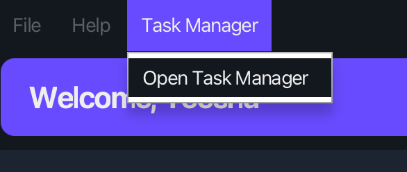

# TaskManager User Guide

ClientNest includes a built-in **TaskManager** feature to help users manage their personal tasks, deadlines, and events. The TaskManager operates through a command-line interface within a dedicated window, allowing users to track tasks independently of their contact list.

This guide outlines the available commands and input formats for using the TaskManager.

--------------------------------------------------------------------------------------------------------------------

## Launching the TaskManager

The TaskManager can be accessed via the **top menu bar** in the ClientNest main window. Selecting the TaskManager option will open a new window where you can input commands.

  

Users may type commands directly into the input box provided in the TaskManager window and press Enter to execute them. The task list will update accordingly.

--------------------------------------------------------------------------------------------------------------------

## Notes about the command format

<box type="info" seamless>

* Words in `UPPER_CASE` are placeholders for user-supplied input.  
  Example: `todo TASK_DESCRIPTION` may be used as `todo Follow up with client`.

* Items in square brackets are optional.  
  Example: `find KEYWORD [MORE_KEYWORDS]` allows `find onboarding`, or `find onboarding review`.

* Date and time inputs must follow the format: `d/M/yyyy HHmm`  
  Example: `5/4/2025 1600` refers to 5 April 2025 at 4:00 PM.

</box>

--------------------------------------------------------------------------------------------------------------------

## Features

### Adding a To-Do Task: `todo`

Adds a general task that does not have a specific deadline or time.

Format: `todo TASK_DESCRIPTION`

Example: `todo Review Q2 sales report draft`

---

### Adding a Deadline Task: `deadline`

Adds a task that must be completed by a specific date and time.

Format: `deadline TASK_DESCRIPTION /by d/M/yyyy HHmm`

Example: `deadline Finalise pitch deck for Acme Corp /by 10/4/2025 1800`

---

### Adding an Event Task: `event`

Adds a scheduled event with a start and end time.

Format: `event TASK_DESCRIPTION /from d/M/yyyy HHmm /to d/M/yyyy HHmm`

Example: `event Client onboarding meeting with Beta Ltd /from 15/4/2025 0930 /to 15/4/2025 1030`

---

### Marking a Task as Done: `mark`

Marks the specified task as completed.

Format: `mark TASK_NUMBER`

Example: `mark 2`

---

### Marking a Task as Not Done: `unmark`

Marks the specified task as incomplete.

Format: `unmark TASK_NUMBER`

Example: `unmark 2`

---

### Deleting a Task: `delete`

Removes a task from the list based on its index in the task list.

Format: `delete TASK_NUMBER`

Example: `delete 3`

---

### Finding Tasks by Keyword: `find`

Searches for tasks whose descriptions contain any of the provided keywords.

Format: `find KEYWORD [MORE_KEYWORDS]`

* The search is case-insensitive.
* Multiple keywords will return tasks that match any one of them.

Example: `find beta follow-up`

---

### Viewing Tasks on a Specific Day: `agenda`

Displays all **Deadline** and **Event** tasks that occur on a specific date.

Format: `agenda for d/M/yyyy`

Example: `agenda for 15/4/2025`

---

### Listing All Tasks: `list`

Displays the current list of tasks along with their completion status.

Format: `list`

---

### Viewing Help: `help`

Displays a list of all available TaskManager commands and their formats.

Format: `help`

---

### Exiting the TaskManager: `exit`

Closes the TaskManager window.

Format: `exit`

--------------------------------------------------------------------------------------------------------------------

## Saving the data

TaskManager data is saved automatically to the hard disk after any command that modifies the task list. There is no need for manual saving.

--------------------------------------------------------------------------------------------------------------------

## Command summary for TaskManager

Action       | Format
-------------|---------------------------------------------------------------
Add To-Do    | `todo TASK_DESCRIPTION`
| e.g. `todo Update CRM tags for Delta Group`
Add Deadline | `deadline TASK_DESCRIPTION /by d/M/yyyy HHmm`
| e.g. `deadline Prepare monthly client report /by 20/4/2025 1700`
Add Event    | `event TASK_DESCRIPTION /from d/M/yyyy HHmm /to d/M/yyyy HHmm`
| e.g. `event Product demo for Zeta Inc /from 18/4/2025 1400 /to 18/4/2025 1500`
Mark Done    | `mark TASK_NUMBER`
Unmark       | `unmark TASK_NUMBER`
Delete       | `delete TASK_NUMBER`
Find         | `find KEYWORD [MORE_KEYWORDS]`
| e.g. `find delta onboarding`
Agenda       | `agenda for d/M/yyyy`
| e.g. `agenda for 18/4/2025`
List         | `list`
Help         | `help`
Exit         | `exit`

