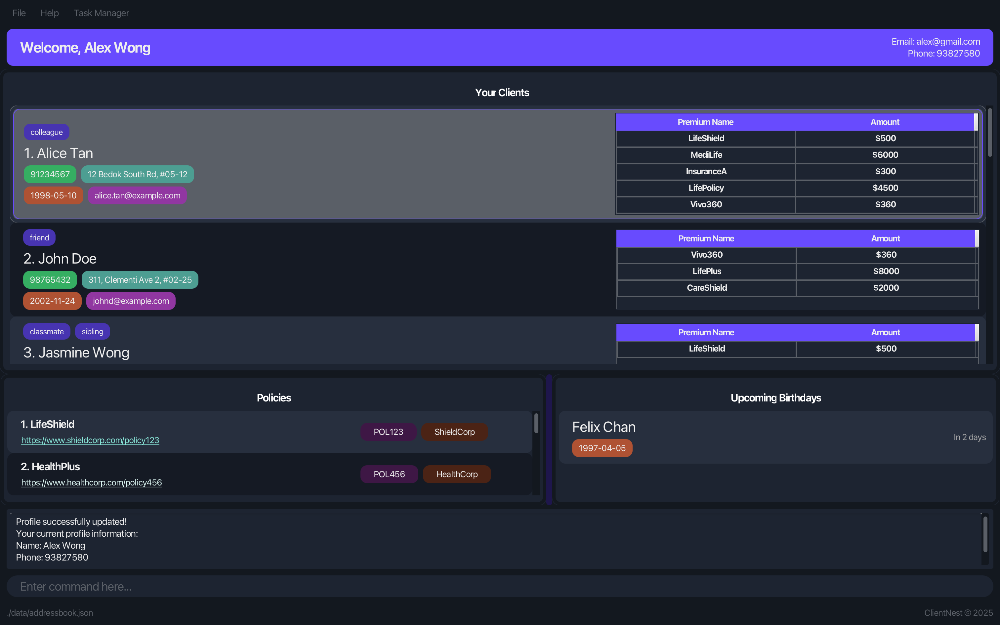
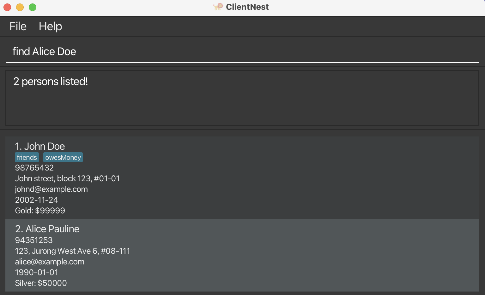
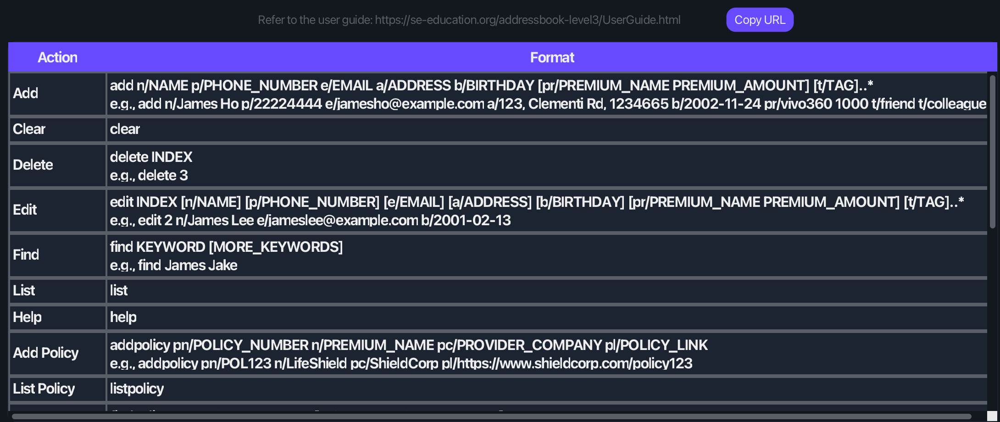
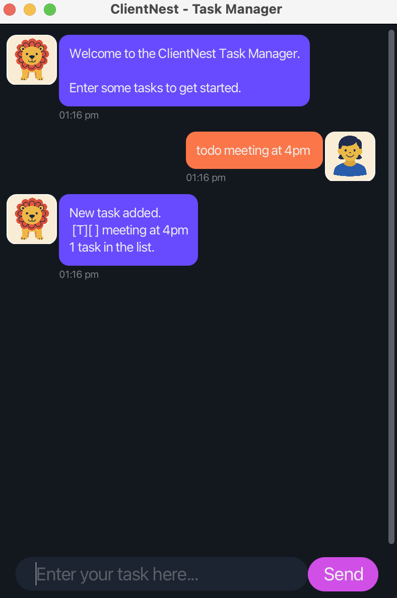

# ClientNest User Guide

**ClientNest** is a **desktop application designed to help financial advisors manage client relationships, stay organized, and follow up effectively**. It combines the speed and precision of a **Command Line Interface (CLI)** with the accessibility of a **Graphical User Interface (GUI)**, allowing users to navigate and execute tasks efficiently through typed commands or interactive elements.

Whether you're adding new clients, planning engagement tasks, or tracking important data like Premiums and Birthdays, ClientNest helps you maintain meaningful connections and grow your client base with confidence.

<!-- * Table of Contents -->
## Table of Contents
- [Quick start](#quick-start)
- [Features](#features)
  - [Person Related Command](#person-related-command)
    - [Adding A Person](#adding-a-person-add)
    - [Listing All Person](#listing-all-persons-list)
    - [Editing A Person](#editing-a-person-edit)
    - [Adding A Premium](#adding-a-premium-to-a-person-addpr)
    - [Editing A Premium](#editing-a-premium-for-a-person-editpr)
    - [Deleting A Premium](#deleting-a-premium-from-a-person-deletepr)
    - [Locating Persons](#locating-persons-by-name-find)
    - [Deleting A Person](#deleting-a-person-delete)
    - [Clearing All Persons](#clearing-all-person-clear)
  - [Policy Related Command](#policy-related-command)
    - [Adding A Policy](#adding-a-policy-addpolicy)
    - [Listing All Policies](#listing-all-policies-listpolicy)
    - [Editing A Policy](#editing-a-policy-editpolicy)
    - [Locating A Policy](#locating-policy-by-name-findpolicy)
    - [Deleting A Policy](#deleting-a-policy-deletepolicy)
  - [ClientNest Commands](#clientnest-commands)
    - [Viewing Help: `help`](#viewing-help-help)
    - [Exiting The Program: `exit`](#exiting-the-program-exit)
    - [Editing User Profile: `profile`](#editing-user-profile-profile)
    - [Saving and Editing Client Data](#saving-and-editing-client-data)
    - [Saving and Editing User Profile Data](#saving-and-editing-user-profile-data)
    - [Upcoming Birthdays Panel](#upcoming-birthdays-panel)
    - [Viewing and Managing Tasks: `TaskManager`](#viewing-and-managing-tasks-taskmanager)
- [FAQ](#faq)
- [Known issues](#known-issues)
- [Command summary for ClientNest](#command-summary-for-clientnest)
<page-nav-print />

--------------------------------------------------------------------------------------------------------------------

## Quick start

1. Ensure you have Java `17` or above installed in your Computer. 
   **Mac users:** Ensure you have the precise JDK version prescribed [here](https://se-education.org/guides/tutorials/javaInstallationMac.html).

2. Download the latest `.jar` file from [here](https://github.com/AY2425S2-CS2103-F10-2/tp/releases).

3. Copy the file to the folder you want to use as the _home folder_ for your ClientNest data.

4. Open a command terminal, `cd` into the folder you put the jar file in, and use the `java -jar ClientNest.jar` command to run the application. 
   A GUI similar to the below should appear in a few seconds. Note how the app contains some sample data. 
   

5. Start typing commands in the input box and press Enter to execute them.

6. Refer to the [Features](#features) below for details of each command.

--------------------------------------------------------------------------------------------------------------------

## Features

**Notes about the command format:** 

* Words in `UPPER_CASE` are the parameters to be supplied by the user. 
  e.g. in `add n/NAME`, `NAME` is a parameter which can be used as `add n/John Doe`.

* Items in square brackets are optional. 
  e.g `n/NAME [t/TAG]` can be used as `n/John Doe t/friend` or as `n/John Doe`.

* Items with `…`​ after them can be used multiple times including zero times. 
  e.g. `[t/TAG]…​` can be used as ` ` (i.e. 0 times), `t/friend`, `t/friend t/family` etc.

* Parameters can be in any order. 
  e.g. if the command specifies `n/NAME p/PHONE_NUMBER`, `p/PHONE_NUMBER n/NAME` is also acceptable.

* Extraneous parameters for commands such as `help`, `exit` and `clear` will be ignored. 
  e.g. if the command specifies `help 123`, it will be interpreted as `help`.

* Extraneous parameters for listing commands such as `list` and `listpolicy` will result in denied command. 
  e.g. if the command specifies `list 123`, the result display will notify user of the extraneous parameters and the command will be ignored.

* If you are using a PDF version of this document, be careful when copying and pasting commands that span multiple lines as space characters surrounding line-breaks may be omitted when copied over to the application.

### Person Related Command

Fields     | Requirements
-----------|----------------------------------------------------------------------------------------------------------------------------------------------------------------------
**n/Name** | Names should only contain alphanumeric characters and spaces, 70 characters or less, and it should not be blank
**p/PHONE_NUMBER** | Phone numbers should only contain numbers, and it should be between 3 to 15 digits long.   No spaces, symbols, or country codes are allowed (e.g. `+`, `()`, `-` are not valid).
**e/EMAIL** | Emails must follow the format `local-part@domain`, and: • The **local-part**: &nbsp;&nbsp;&nbsp;&nbsp;• Must be at least 2 characters. &nbsp;&nbsp;&nbsp;&nbsp;• May include letters, numbers, and `+`, `_`, `.`, `-`. &nbsp;&nbsp;&nbsp;&nbsp;• Cannot start or end with a special character. • The **domain**: &nbsp;&nbsp;&nbsp;&nbsp;• Consists of domain labels separated by periods. &nbsp;&nbsp;&nbsp;&nbsp;• Each label must start and end with alphanumeric characters. &nbsp;&nbsp;&nbsp;&nbsp;• Labels may include hyphens in the middle. &nbsp;&nbsp;&nbsp;&nbsp;• The final label must be at least 2 characters long. • The full email must not exceed 70 characters.
**a/ADDRESS** | Addresses must contain at least one alphabetic character, be between 1 and 100 characters, and should not be blank
**b/BIRTHDAY** | Birthdays should be in the format `YYYY-MM-DD` and must not be a future date or earlier than 1900.  **Note:** If an invalid date is given (e.g., `2001-02-29`, `2024-04-31`), the system will adjust to the nearest valid date (e.g., `2001-02-28`, `2024-04-30`).
**[pr/PREMIUM_NAME PREMIUM_AMOUNT]** | Optional field, A premium entry must include a valid name followed by a positive integer.  • Each client can have multiple premiums, but only one per unique name. • You can add multiple premiums using spaces, e.g., `pr/Life 500 Accident 200`.  • PREMIUM_NAME accepts special characters.  • PREMIUM_AMOUNT will only accept positive whole integers up to 10 digits long  •PREMIUM_AMOUNT will not accept special characters other than `$` preceding the amount without a space.  • Multiple `$` will be trimmed to one.
**[t/TAG]…** | Optional field, Tag names should be alphanumeric

#### <ins>Adding A Person: `add`</ins>

Adds a new contact to your ClientNest.

Format: `add n/NAME p/PHONE_NUMBER e/EMAIL a/ADDRESS b/BIRTHDAY [pr/PREMIUM_NAME PREMIUM_AMOUNT] [t/TAG]…​`

* Please note that the double quote (") and apostrophe (') are treated as special characters in the input. When used within the input, such as in " " (with a space inside the quotes), they do not represent a space. Instead, they are treated literally as the quote or apostrophe characters themselves.
* All inputs to the fields will be automatically trimmed. This means that any extra spaces at the beginning or end of the input will be removed. For example, if the address entered is ` Block 581 `, it will be trimmed to `Block 581`.

Examples:
* `add n/John Doe p/98765432 e/johnd@example.com a/John street, block 123, #01-01 b/2002-11-24 pr/Gold 99999 t/friends t/owesMoney`
* `add n/Alice Pauline p/94351253 e/alice@example.com a/123, Jurong West Ave 6, #08-111 b/1990-01-01 pr/Silver 50000`

**Parameter Order:**  
You may enter parameters in any order. For example:  
`add p/98765432 n/John Doe e/john@example.com ...` is also valid.

**Duplicate Contact Rule:**  
ClientNest will prevent adding a contact that matches an existing one based on:
- Name (case-insensitive)
- Phone number
- Email (case-insensitive)
- Address (case-insensitive)
- Birthday

Premiums and tags are not considered when detecting duplicates.

#### <ins>Listing All Persons: `list`</ins>

Displays all contacts stored in ClientNest.

Format: `list`

#### <ins>Editing A Person: `edit`</ins>

Edits details of an existing contact.

Format: `edit INDEX [n/NAME] [p/PHONE] [e/EMAIL] [a/ADDRESS] [b/BIRTHDAY] [pr/PREMIUM_NAME PREMIUM_AMOUNT] [t/TAG]…​`

* Edits the person at the specified `INDEX`. The index refers to the index number shown in the displayed person list. The index **must be a positive integer** 1, 2, 3, …​
* At least one of the optional fields must be provided.
* Existing values will be updated to the input values.
* When editing tags, the existing tags of the person will be removed i.e adding of tags is not cumulative.
* When editing premiums, the existing premiums of the person will be removed i.e adding of premiums is not cumulative.
* You can remove all the person's tags by typing `t/` without
  specifying any tags after it.

Examples:
*  `edit 1 p/91234567 e/johndoe@example.com` Edits the phone number and email address of the 1st person to be `91234567` and `johndoe@example.com` respectively.
*  `edit 2 n/Betsy Crower t/` Edits the name of the 2nd person to be `Betsy Crower` and clears all existing tags.

#### <ins>Adding A Premium To A Person: `addpr`</ins>

Adds a premium to a person identified by the index number in the displayed person list.

Format: `addpr INDEX pr/PREMIUM_NAME PREMIUM_AMOUNT`

* Adds the specified premium to the person at the specified `INDEX`.
* The index refers to the index number shown in the displayed person list.
* The index **must be a positive integer** 1, 2, 3, …​
* The same premium by name cannot be added twice to the same person.
* Please refer to the restriction of inputs for each field above under pr/ field under Person Related Command.

Examples:
* `list` followed by `addpr 1 pr/LifeShield $300` adds a premium named "LifeShield" with amount "$300" to the 1st person in the address book.
* `find John` followed by `addpr 1 pr/HealthPlus $500` adds a premium named "HealthPlus" with amount "$500" to the 1st person in the results of the `find` command.

#### <ins>Editing A Premium To A Person: `editpr`</ins>

Edits the premium details identified by premium name of a person identified by the index number in the displayed person list.

Format: `editpr INDEX pr/PREMIUM_NAME PREMIUM_AMOUNT`

* Edits the specified premium for the person at the specified `INDEX`.
* The index refers to the index number shown in the displayed person list.
* The index **must be a positive integer** 1, 2, 3, …​
* The premium name specified must already exist for that person.
* Only the premium amount will be updated.
* Please refer to the restriction of inputs for each field above under pr/ field under Person Related Command.

Examples:
* `list` followed by `editpr 1 pr/LifeShield $350` changes the amount of the "LifeShield" premium to "$350" for the 1st person in the address book.
* `find John` followed by `editpr 1 pr/HealthPlus $600` changes the amount of the "HealthPlus" premium to "$600" for the 1st person in the results of the `find` command.

#### <ins>Deleting A Premium From A Person: `deletepr`</ins>

Deletes a specific premium from a person identified by the index number in the displayed person list.

Format: `deletepr INDEX pr/PREMIUM_NAME`

* Deletes the specified premium from the person at the specified `INDEX`.
* The index refers to the index number shown in the displayed person list.
* The index **must be a positive integer** 1, 2, 3, …​
* Only the premium name is required to identify which premium to delete.
* Please refer to the restriction of inputs for each field above under pr/ field under Person Related Command.

Examples:
* `list` followed by `deletepr 1 pr/LifeShield` deletes the "LifeShield" premium from the 1st person in the address book.
* `find John` followed by `deletepr 1 pr/HealthPlus` deletes the "HealthPlus" premium from the 1st person in the results of the `find` command.

#### <ins>Locating Persons By Name: `find`</ins>

Finds persons whose names contain any of the given keywords.

Format: `find KEYWORD [MORE_KEYWORDS]`

* The search is case-insensitive. e.g `hans` will match `Hans`
* The order of the keywords does not matter. e.g. `Hans Bo` will match `Bo Hans`
* The `find` command only searches the name field. It does not search by phone, email, address, tags, or other fields.
* Only full words will be matched e.g. `Han` will not match `Hans`
* Persons matching at least one keyword will be returned (i.e. `OR` search).
  e.g. `Hans Bo` will return `Hans Gruber`, `Bo Yang`

Examples:
* `find John` returns `john` and `John Doe`
* `find Alice Hoe` returns `John Doe`, `Alice Pauline` 
  

#### <ins>Deleting A Person: `delete`</ins>

Deletes the specified person from the client list.

Format: `delete INDEX`

* Deletes the person at the specified `INDEX`.
* The index refers to the index number shown in the displayed person list.
* The index **must be a positive integer** 1, 2, 3, …​

Examples:
* `list` followed by `delete 2` deletes the 2nd person in the address book.
* `find Betsy` followed by `delete 1` deletes the 1st person in the results of the `find` command.

#### <ins>Clearing All Person: `clear`</ins>

Clears all person from your ClientNest.

Format: `clear`

### Policy Related Command

Fields     | Requirements
-----------|----------------------------------------------------------------------------------------------------------------------------------------------------------------------
**n/POLICY_NAME** | Policy Name should only contain alphanumeric characters and spaces, not be longer than 50 characters, and it should not be blank
**pn/POLICY_NUMBER** | Policy Number should only contain alphanumeric characters and spaces, not be longer than 20 characters, and it should not be blank
**pc/PROVIDER_COMPANY** | Provider Company should only contain alphanumeric characters and spaces, not be longer than 70 characters, and it should not be blank
**pl/POLICY_LINK** | Policy Link can optionally start with 'http://', 'https://', or 'ftp://' and may include 'www.'. The domain name should consist of alphanumeric characters, underscores, or hyphens, followed by one or more top-level domains (e.g., '.com', '.org'). You can also include a path (starting with '/')

#### <ins>Adding A Policy: `addpolicy`</ins>

Adds a new policy to your ClientNest.

Format: `addpolicy n/POLICY_NAME pn/POLICY_NUMBER pc/PROVIDER_COMPANY pl/POLICY_LINK​`

* No 2 policy share the same policy number.
* The policy name is used in the `findpolicy` command.

Examples:
* `addpolicy pn/POL123 n/LifeShield pc/ShieldCorp pl/https://www.shieldcorp.com/policy123 `

#### <ins>Listing All Policies: `listpolicy`</ins>

Displays all policies details stored in ClientNest.

Format: `listpolicy`

#### <ins>Editing A Policy: `editpolicy`</ins>

Edits details of an existing policy details.

Format: `editpolicy INDEX [n/POLICY_NAME] [pn/POLICY_NUMBER] [pc/PROVIDER_COMPANY] [pl/POLICY_LINK]​`

* Edits the policy at the specified `INDEX`. The index refers to the index number shown in the displayed policy list. The index **must be a positive integer** 1, 2, 3, …​
* At least one of the fields must be provided.
* Existing values will be updated to the input values.
* Please refer to the restriction of inputs for each field at the addpolicy command 

Examples:
*  `editpolicy 1 n/Life Shield pl/https://www.lifeshield.com` Edits the policy name and policy link of the 1st policy to be `Life Shield` and `https://www.lifeshield.com` respectively.

#### <ins>Locating Policy By Name: `findpolicy`</ins>

Finds policies whose names contain any of the given keywords.

Format: `findpolicy KEYWORD [MORE_KEYWORDS]`

* The search is case-insensitive. e.g `life` will match `Life`
* The order of the keywords does not matter. e.g. `Life Health` will match `Health Life`
* Only the name is searched, not any other fields (company, link, number).
* Full words and partial will be matched e.g. `Li` will match `Lifeshield`
* Policies matching at least one keyword will be returned (i.e. `OR` search).
  e.g. `Life Health` will return `LifeShield`, `HealthPlus`

Examples:
* `findpolicy Life` returns `LifeShield`, `Life Protect`
* `findpolicy Health Life` returns `HealthCare Basic`, `LifeSecure Plus`

#### <ins>Deleting A Policy: `deletepolicy`</ins>

Deletes the specified policy from the policy list.

Format: `deletepolicy INDEX`

* Deletes the policy at the specified `INDEX`.
* The index refers to the index number shown in the displayed policy list.
* The index **must be a positive integer** 1, 2, 3, …​

Examples:
* `listpolicy` followed by `deletepolicy 2` deletes the 2nd policy in the policy book.
* `findpolicy Health` followed by `deletepolicy 1` deletes the 1st policy in the results of the `findpolicy` command.

### ClientNest Commands

#### <ins>Viewing Help: `help`</ins>

Shows a message explaining how to access the help page.

Format: `help`

#### <ins>Exiting The Program: `exit`</ins>

Exits the program.

Format: `exit`

#### <ins>Editing User Profile: `profile`</ins>

Edits details of the current user's profile.

Format: `profile [n/NAME] [p/PHONE] [e/EMAIL]`

* Edits the current user's profile.
* At least one of the optional fields must be provided.
* Existing values will be updated to the input values.
* Edited values will be updated on the Hero Section of the main window.

Examples:
*  `profile n/John Doe p/91234567 e/johndoe@example.com` Edits the name, phone number and email address of the user to be `John Doe`, `91234567` and `johndoe@example.com` respectively.

#### <ins>Saving and Editing Client Data</ins>

ClientNest data is saved to your hard disk **automatically** after any command that changes the client or policy list. There is **no need to save manually**.

ClientNest stores client and policy data in a JSON file located at:  
`[JAR file location]/data/addressbook.json`

Advanced users may edit this file directly.

> ⚠ CAUTION: If your edits make the file format invalid, ClientNest will discard all data and start with an empty address book upon the next launch.

It’s **strongly recommended** to back up the file before editing.  

Also, be aware that invalid or out-of-range values (e.g. future birthdays or malformed emails) can cause unexpected app behavior.

#### <ins>Saving and Editing User Profile Data</ins>

ClientNest user profile information is also saved **automatically** after any command that updates your name, phone number, or email.

User profile data is stored in the JSON file:  
`[JAR file location]/data/userprofile.json`

Advanced users may edit this file directly to customize their profile.

> ⚠ CAUTION: If your edits make the user profile file invalid, ClientNest will revert to **default user values** on the next run.

Default values are:  
Name: `Guest`  
Phone: `00000000`  
Email: `guest@example.com`

As with client data, it’s advisable to make a backup before editing, and only do so if you’re confident in maintaining the correct format.

#### <ins>Upcoming Birthdays Panel</ins>

The **Upcoming Birthdays** panel displays a list of clients whose birthdays fall within the next 30 days.

This panel appears to the right of the client list and updates automatically whenever a birthday is added or edited. You can scroll through the list to see upcoming birthdays and easily identify clients you may want to reach out to.

No commands are required — just ensure each contact has a valid birthday entered, and ClientNest will handle the rest.

#### <ins>Viewing and Managing Tasks: `TaskManager`</ins>

  

You can access the TaskManager panel from the top menu bar. A new window will open, allowing you to type commands and manage tasks independently of your main contact list.

In TaskManager, you can:

* Add To-Do, Deadline, and Event tasks
* Mark and unmark tasks as done
* Delete tasks
* Search for tasks by keyword

All commands are typed into the input box, similar to the main ClientNest window.

> 💡 **Tip:** Type `help` inside the TaskManager window to view all available task commands.

For more in-depth information about TaskManager commands and their formats, refer to the [ _Task Manager User Guide_ ](TaskManagerUserGuide.md)

--------------------------------------------------------------------------------------------------------------------

## FAQ

**Q**: How do I transfer my data to another Computer? 
**A**: Install the app in the other computer and overwrite the empty data file it creates with the file that contains the data of your previous ClientNest home folder.

--------------------------------------------------------------------------------------------------------------------

## Known issues

1. **When using multiple screens**, if you move the application to a secondary screen, and later switch to using only the primary screen, the GUI will open off-screen. The remedy is to delete the `preferences.json` file created by the application before running the application again.
2. **If you minimize the Help Window** and then run the `help` command (or use the `Help` menu, or the keyboard shortcut `F1`) again, the original Help Window will remain minimized, and no new Help Window will appear. The remedy is to manually restore the minimized Help Window.
3. **Opening multiple Task Windows** will result in multiple task manager sessions to open. This will result in inconsistencies in the list of tasks. When multiple windows of task managers are opened, they will behave independently, storing and managing all tasks locally. For each task window that is closed, the task manager will update the task list in `data/taskList.txt`. The last session that closes will overwrite all previous task manager sessions.
4. **If the input string is too long**, the UI will truncate it and display an ellipsis on some screens. This issue will persist on all screens during the following scenarios:
   - If your user profile name and/or email is more than 50 characters;
   - If your premium name is more than 35 characters.
5. **Pressing the "up/down" arrow keys** will replace/erase the current command in the command box.

--------------------------------------------------------------------------------------------------------------------

## Command summary for ClientNest

Action     | Format, Examples
-----------|----------------------------------------------------------------------------------------------------------------------------------------------------------------------
**Add**    | `add n/NAME p/PHONE_NUMBER e/EMAIL a/ADDRESS b/BIRTHDAY pr/PREMIUM_NAME PREMIUM_AMOUNT [t/TAG]…​`   e.g., `add n/James Ho p/22224444 e/jamesho@example.com a/123, Clementi Rd, 1234665 b/1995-05-10 pr/Platinum 150000 t/friend t/colleague`
**Clear**  | `clear`
**Delete** | `delete INDEX`  e.g., `delete 3`
**Edit**   | `edit INDEX [n/NAME] [p/PHONE_NUMBER] [e/EMAIL] [a/ADDRESS] [b/BIRTHDAY] [pr/PREMIUM_NAME PREMIUM_AMOUNT] [t/TAG]…​`  e.g.,`edit 2 n/James Lee e/jameslee@example.com`
**Find**   | `find KEYWORD [MORE_KEYWORDS]`  e.g., `find James Jake`
**Add Premium** | `addpr INDEX pr/PREMIUM_NAME PREMIUM_AMOUNT`   e.g., `addpr 1 pr/LifeShield $300`
**Edit Premium** | `editpr INDEX pr/PREMIUM_NAME PREMIUM_AMOUNT`   e.g., `editpr 1 pr/LifeShield $350`
**Delete Premium** | `deletepr INDEX pr/PREMIUM_NAME`   e.g., `deletepr 1 pr/LifeShield`
**Add Policy** | `addpolicy pn/POLICY_NUMBER n/PREMIUM_NAME pc/PROVIDER_COMPANY pl/POLICY_LINK`   e.g., `addpolicy pn/POL123 n/LifeShield pc/ShieldCorp pl/https://www.shieldcorp.com/policy123`
**Delete Policy** | `deletepolicy INDEX`   e.g., `deletepolicy 1`
**Edit Policy** | `editpolicy INDEX [pn/POLICY_NUMBER] [n/PREMIUM_NAME] [pc/PROVIDER_COMPANY] [pl/POLICY_LINK]`   e.g., `editpolicy 1 n/Life Shield pl/https://www.lifeshield.com`
**Find Policy** | `findpolicy KEYWORD [MORE_KEYWORDS]`   e.g., `findpolicy Life Health`
**Profile** | `profile [n/USER_NAME] [p/PHONE_NUMBER] [e/EMAIL]`   e.g., `profile n/John Doe p/91112222 e/john@gmail.com`
**List**   | `list`
**Help**   | `help`
